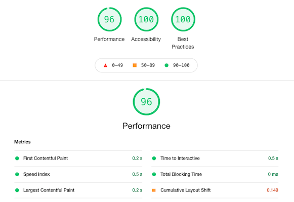

A simple orderbook application
# Order Book Application
A simple application, built using Next.js and Material-UI, which displays a real-time crypto order book.

## Developer Mode
To start the application in dev mode run:
```
npm run dev
```

## Production Mode
To run a production version of the application, first create an optimised build:
```
npm run build
```
The built assets can then be served using
```
npm start
```

## Testing
Some basic BDD tests have been added using Jest and Puppeteer. The tests verify the critical functionality of the app by simulating user interactions. To run the tests, use
```
npm test
```

## Performance

### Initial Load Times
The app scores well when looking at the initial load metrics. By using Next's Static Site Generation (SSG) I was able to achieve very low FCP, FMP and TTI times.

<div style="text-align:center">
    
</div>

### Avoiding Unnecessary Re-renders
Memoization of objects, arrays and functions has been used where appropriate via the useMemo and useCallback React hooks. This avoids unnecessary re-renders and helps to maintain a steady and acceptable frame-rate.

### Web Socket Connection

The application opens a web socket connection to the [Crypto Facilities]('www.cryptofacilities.com') `book_ui_1` stream which sends several messages per second. I opted to have a dedicated worker manage the connection so that it didn't clog up the main UI thread. This worker processes all the incoming messages and updates the internal state of the order book.

#### Throttling Updates
To limit the re-rendering overhead, the worker will update the main thread a maximum of once every 500ms. That way, the data being displayed to the user is real-time (within a second) whilst not over burdening the browser.

The worker will not report any updates for the first 1 second after successfully connecting to a feed to allow the internal state to be populated. This provides a more satisfying initial render to the user whilst still maintaining an acceptable response time.

### Future Enhancements
- Implement Shared Worker so that the same worker is used when the application is open in other browser tabs.
- Implement sliding window (perhaps using a virtualised list) instead of cropping rows of the order book for small screen sizes.
- Add unit tests for reusable components.
- Mock web socket server to unit test the worker's functionality.